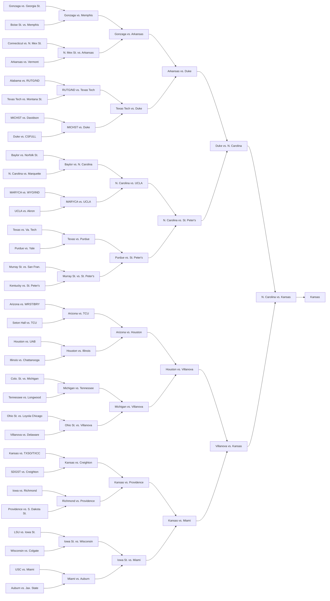
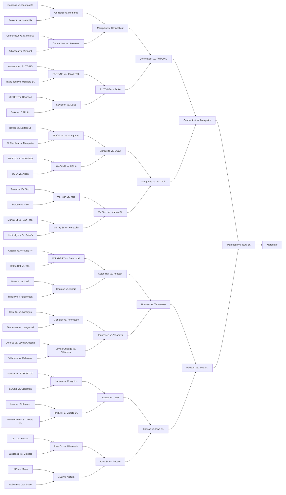

# flatbracket

Small shareable encoding for single-elimination tournament brackets (e.g. March Madness)

## Usage

Program relies on newline delimited "teams" file listing all tournament teams in order
of initial tournament matchups. Examples of "teams" file can be found in the `brackets/` folder.

### Create

    python -m flatbracket brackets/2022/womens
    South Carolina vs. Howard
    [0/1]: 0
    ...
    ...
    ...
    South Carolina vs. Connecticut
    [0/1]: 0

    Bracket: QFYEEmTKoig

### View

    $ python -m flatbracket brackets/2022/mens FoASVv4ou3U



    $ python -m flatbracket brackets/2022/mens RANDOM
    Bracket: RANDOM
    UjdRGjmNETg



## Encoding

Brackets are encoded in URL-safe base64 for easy shareability.
The decoded bytes are a bit sequence storing the results of each matchup in order of tournament rounds,
starting with the first round and ending with the championship.

For instance, a bracket for the 2022 March Madness: Men's tournament can be encoded into 11 characters (`FoASVv4ou3U`).

```python
# FoASVv4ou3U
BRACKET_2022 = 0b1_1_1_0_1_0_1_10_11_10_11_0010_1000_1111_1110_01010110_00010010_10000000_00010110.to_bytes(8, "little")
```

## Output

Program outputs in the [Mermaid](https://mermaid.js.org/) diagramming format.
It's possible to run the program with partial bracket information,
but diagram will not be a single connected component.

- [Interactive viewer/editor](https://mermaid.live/)
- [Embedded in GitHub Flavored Markdown](https://github.blog/2022-02-14-include-diagrams-markdown-files-mermaid/)
````

````
